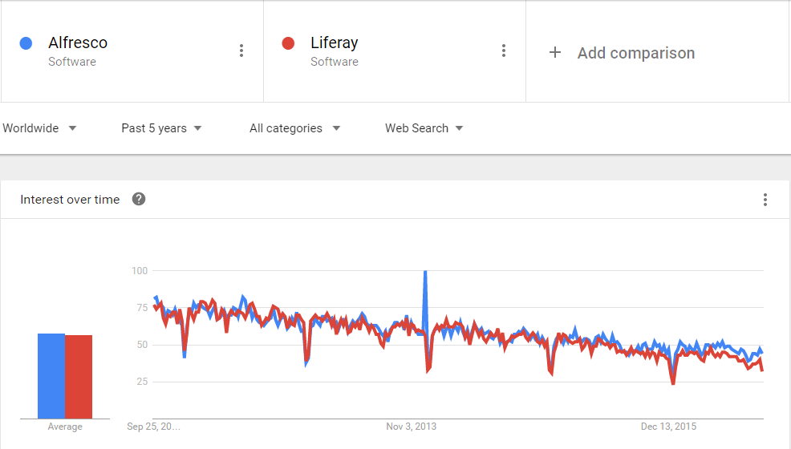

# Open source Content Management System

Top 24 Java-Based Content Management Systems - [DZone Web Dev](https://dzone.com/articles/top-21-java-based-content)

- Alfresco
- Liferay
- Magnolia
- MeshCMS
- [Hippo](https://www.onehippo.org/)

