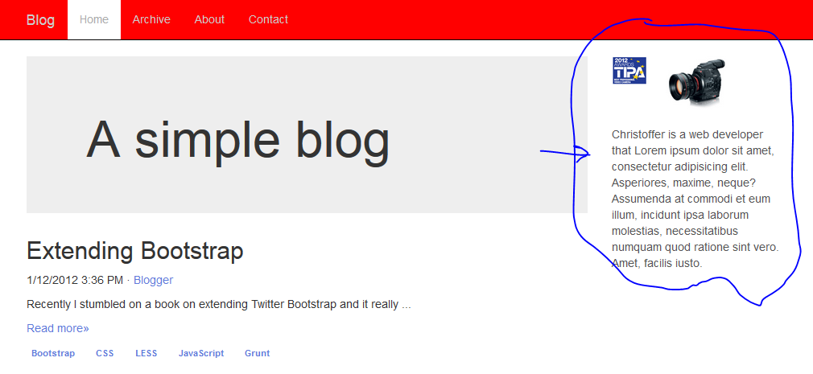

# Extending Bootstrap

Install bootstrap with npm

    C:\WebStormWS\Angular2Workspace\ExtendingBootstrap>npm install jquery@2.2.4
    `-- jquery@2.2.4

	>npm install bootstrap@3
	>npm install -g grunt-cli
	>cd node_modules\bootstrap
	>\node_modules\bootstrap>npm install
	\ExtendingBootstrap\node_modules\bootstrap>grunt dist

[Free bootstrap themes @ bootswatch](http://bootswatch.com/paper/)

[w3schools theme tutorial](http://www.w3schools.com/bootstrap/bootstrap_theme_me.asp)
[Cool w3schools Band theme tutorial](http://www.w3schools.com/bootstrap/bootstrap_theme_band.asp)
[Bootstrap live customizer](http://bootstrap-live-customizer.com/)
3 years old text[How To Make A Bootstrap 3 Theme The Proper Way](http://antjanus.com/blog/uncategorized/make-bootstrap-3-theme-proper-way/)
## 4. LESS

Recess is a LESS compiler

	npm install -g recess

Create \ExtendingBootstrap\less\styles.less

    @font-family: Arial;
    @text-color: red;
    body {
    font-family: @font-family;
    color: @text-color;
    }

Compile less to css

	recess styles.less --compile > styles.css

OR

    recess styles.less --compress > styles.min.css

Read how to setup [File watcher](https://www.jetbrains.com/help/webstorm/2016.2/new-watcher-dialog.html)

## Compiling CSS and JavaScript

Create _less_ file \ExtendingBootstrap/less>main.less:

    @import "../node_modules/bootstrap/less/bootstrap.less";

Try to compile with recess

    C:\webStormWS\ExtendingBootstrap/less>recess main.less --compile > css/main.css
    > produce empty main.css
    C:\WebStormWS\Angular2Workspace\ExtendingBootstrap\less>recess main.less
    Analyzing the following files: main.less
    Parser error in ..\node_modules\bootstrap\less\type.less
    
         211.   dd {
         212.     &:extend(.clearfix all); // Clear the floated `dt` if an empty `dd` is present
         213.   }

Bootstrap uses Grunt for its build system, with convenient methods for working with the framework. It's how we compile our code, run tests, and more
[Compiling CSS and JavaScript](http://getbootstrap.com/getting-started/#grunt)
Follow instructions as is.
Installing Grunt
To install Grunt, you must first download and install node.js (which includes npm). npm stands for node packaged modules and is a way to manage development dependencies through node.js.

Then, from the command line:
Install grunt-cli globally with npm install -g grunt-cli.
Navigate to the root /bootstrap/ directory, then run npm install. npm will look at the package.json file and automatically install the necessary local dependencies listed there.
When completed, you'll be able to run the various Grunt commands provided from the command line.

change index.html to point new bootstrap
 
 `<link href=".\node_modules\bootstrap\dist\css\bootstrap.min.css" rel="stylesheet">`

- Save index.html as index-2.html

    add C:\webStormWS\ExtendingBootstrap\bootstrap-3.3.7\less\canon-variables.less
    with @brand-color: #bada55;

- 

add C:\webStormWS\ExtendingBootstrap\node_modules\bootstrap\less\canon-theme.less

    .content {
      .make-md-column(9);
      article {
        margin-bottom: 40px;
      }
    }
    .sidebar {
      .make-md-column(3);
    }
    .sidebar-avatar {
      display: block;
      margin-bottom: 20px;
      max-width: 100%;
    }
    .sidebar-bio {
      color: @gray;
    }

add importing _canon-theme.less canon-variables.less_ to the end of _bootstrap\less\bootstrap.less_
cause page rendering Error
    
    @import "canon-variables.less";
    @import "canon-theme.less";

Run Grunt

    C:\WebStormWS\Angular2Workspace\ExtendingBootstrap\node_modules\bootstrap>grunt dist

refresh index

compare with book p.38

## Custom theme

move custom less files to their own sub-folder

    \ExtendingBootstrap\node_modules\bootstrap\less\canon-theme\canon-theme.less
    \ExtendingBootstrap\node_modules\bootstrap\less\canon-theme\canon-variables.less

and fix _\ExtendingBootstrap\node_modules\bootstrap\less\bootstrap.less_

    @import "canon-theme/canon-variables.less";
    @import "canon-theme/canon-theme.less";
    