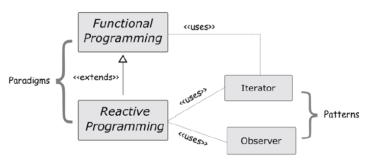

# RxJs In Action - Reactive Extensions for JavaScript

>_“An API for asynchronous programming with observable streams”_

From [Reactive Extensions project](http://reactivex.io/)
> [RxJS] is a combination of the best ideas from the Observer pattern, the Iterator pattern, and functional
  programming.

###javascript Closure

- [w3schools js closures](http://www.w3schools.com/js/js_function_closures.asp)

Closure example:

    var add = (function () {
        var counter = 0;
        return function () {return counter += 1;}
    })();
    add();
    add();
    add();
    // the counter is now 3

### JavaScript Promises support and Polyfill

from p 11

    makeHttpCall('<host1>/transactions')
    .then(item => makeHttpCall(`<host2>/data/${item.getId()}/info`))
    .then(dataInfo => makeHttpCall(`<host3>/data/files/${dataInfo.files}`))
    .then(processFiles);

- [JavaScript Promises support and Polyfill](http://www.javascriptkit.com/javatutors/javascriptpromises.shtml)

### 1.4.1 Thinking in streams: data flows & propagation

[Array extras](https://www.sitepoint.com/back-to-basics-array-extras/) 
>JavaScript ES5 introduced new Array methods, known as the “Array extras,” which enable some level of native support
>for functional programming. These include map, reduce, filter, some, every, and others.

## 2. Reacting with RxJS

p.27 Reactive programming paradigm builds and extends from functional programming. Also, it leverages
commonly known design patterns such as Iterator and Observer

> JavaScript functions are first-class citizens also known as [higher-order functions](https://www.sitepoint.com/higher-order-functions-javascript/)

Listing 2.1 Processing collections with map, reduce, and filter
    
    const isEven = num => num % 2 === 0;
    const square = num => num * num;
    const add = (a, b) => a + b;
    const arr = [1, 2, 3, 4, 5, 6, 7, 8, 9, 10];
    arr.filter(isEven).map(square).reduce(add); //-> 220

OR with streams

    Stream([1, 2, 3, 4, 5, 6, 7, 8, 9, 10])
    .filter(isEven)
    .map(square)
    .reduce(add)
    .subscribe(console.log); //-> 220

Consider how many functions with _for_ loops and conditional statements you should use in non-functional approach?  

p.52 Listing 2.4 Imperative version of a smart search textbox
     
     
     const testData = [
     '4111111111111111',
     '5105105105105100',
     '4342561111111118',
     '6500000000000002'
     ];
     
     searchBox.addEventListener('keyup', function (event) { ❶
                                             var query = event.target.value;
                                             var searchResults = [];
                                             if(query && query.length > 0) {
                                                 for(result of testData) { ❷
                                                     if(result.startsWith(query)) {
                                                        searchResults.push(result);
                                                     }
                                                 }
                                             }
                                             if(searchResults.length === 0) { ❸
                                                clearResults(results);
                                             } else {
                                                 for(result of searchResults) {
                                                    appendResult(result, results);
                                                 }
                                             }
                                         }
                                );
                                
     function clearResults(container) { ❹
         while(container.childElementCount > 0) {
            container.removeChild(container.firstChild);
         }
     }
     function appendResult(result, container) { ❺
         var li = document.createElement('li');
         var text = document.createTextNode(result);
         li.appendChild(text);
         container.appendChild(li);
     }
     
 ❶ Listen for all ‘keyup’ events on that search box
 ❷ Loop through all of our test data URLs and find matches
 ❸ If no matches are found, clear the list of search results; otherwise, append the items found
 ❹ Function used to clear search results container
 ❺ Function used to append a result onto the container
 
Listing 2.5 Reactive approach of a smart search text box

    const testData = [
    '4111111111111111',
    '5105105105105100',
    '4342561111111118',
    '6500000000000002'
    ];
    
    const search$ = Rx.Observable.fromEvent(inputText, 'keyup') ❶
                                    .map(event => event.target.value) ❷
                                    .mergeMap(query => Rx.Observable.from (findAccounts(query))); ❸
    search$.forEach(result => { ❹
            if(result.length === 0) {
                clearResults(results);
            } else {
                appendResults(results, result);
            }
        }
    );
    
    function findAccounts(query) {
                                return testData.filter(item => {
                                        return query.length > 0 && item.startsWith(query);
                                        }
                                );
    }

❶ Creating an Observable around the ‘keyup’ event. As a convention, we’ll use a $ to indicate that a variable is
referencing a stream. This will be useful later on when we begin to combine streams together. Also, we use const
to denote that streams are, in fact, immutable references
❷ Capture the value within the textbox
❸ Fetch results; if no matches are found, return an empty array
❹ Iterate and process the results 

Rewrite imperative version of _clearResults()_ function without _while_ loop:

    function clearResults(container) {
        if(container.childElementCount !== 0) { // ❶
        container.removeChild(container.firstChild);
        clearResults(container); ❷
        }
    }

❶ Continue only if there are children to remove (base step)
❷ Continue calling itself on the container (recursive step)

Rewrite findAccounts(query) from listing 2.5 so it take testData as par-r arr

    function findAccountsInArray(arr, query) {
            return !arr ? [] : arr.filter(item =>{
                                                   return query.length > 0 && item.startsWith(query);
                                                 }
                                         );
    }

partially binding arguments onto this function using JavaScript’s bind() method on the function prototype, creating 
our new _findAccounts_ function:

    const findAccounts = findAccountsInArray.bind(null, testData); ❶

❶ Using bind() to fix the testData array to the function’s first parameter.6 The result is single-arity (one-argument)
function findAcounts() that awaits for the query parameter to be provided. See [javascript bind()](https://developer.mozilla.org/en-US/docs/Web/JavaScript/Reference/Global_Objects/Function/bind) for more information.

## 3. Core operators

This chapter covers
• Consuming observables with observers
• Introducing disposal of streams
• Exploring common Observable operators
• Building fluent method chains with map, reduce, and filter
• Additional aggregate operators

### Map operator

it is a single output value or a one-to-one
transformation. In symbolic notation we write it as map :: x -> f(x), where for a given
value x we can associate an input of x with an output of f(x)

    const sixPercent = x => x + (x * .06);
    
    Rx.Observable.of(10.0, 20.0, 30.0, 40.0)
                    .map(sixPercent) ❶
                    .subscribe(console.log); //-> 10.6, 21.2, 31.8, 42.4

❶ Applies this function onto each value of the source Observable

### Filtering operator

Filtering is the process of removing unwanted items from a stream. The criteria to remove
these elements is passed in as selector function, also called the predicate or _discriminant_.

    const isNumericalKeyCode = code => code >= 48 && code <= 57;
    const input = document.querySelector('#input');
    Rx.Observable.fromEvent(input, 'keyup')
                                    .map(event => event.keyCode)
                                    .filter(isNumericalKeyCode)
                                    .subscribe(code => console.log(`User typed:
                                    ${String.fromCharCode(code)}`));

### REDUCE operator 

[Reduce](https://developer.mozilla.org/en-US/docs/Web/JavaScript/Reference/Global_Objects/Array/reduce) - aggregating results.

    const add = (x, y) => x + y;
    Rx.Observable.from([
                        {date: '2016-07-01',amount: -320.00,},
                        {date: '2016-07-13',amount: 1000.00,},
                        {date: '2016-07-22',amount: 45.0,},
                        ])
        .map(R.prop('amount')) ❶
        .reduce(add, 0) ❷
        .subscribe(console.log);

❶ Extract the amount property
❷ Reduce the set of amount values with an add function
